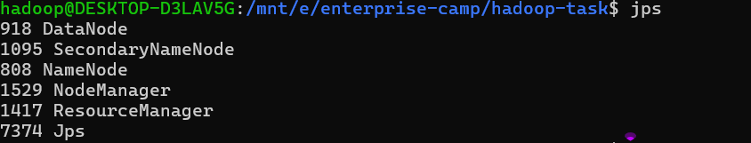
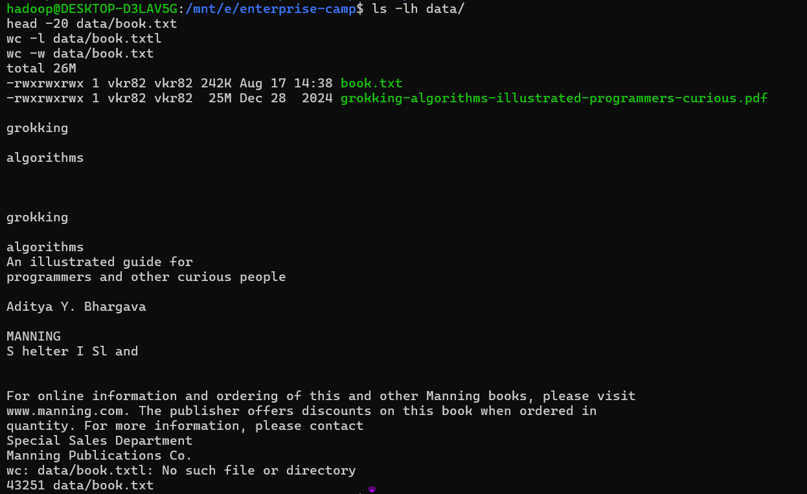
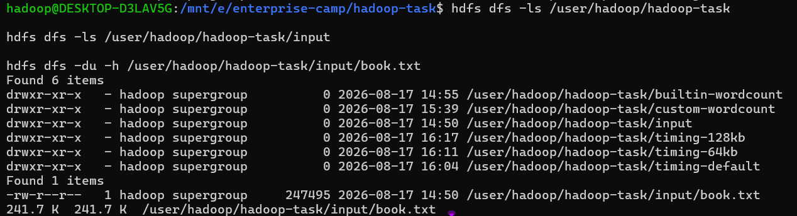
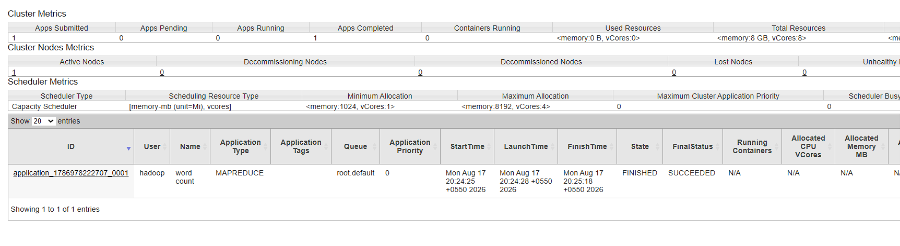
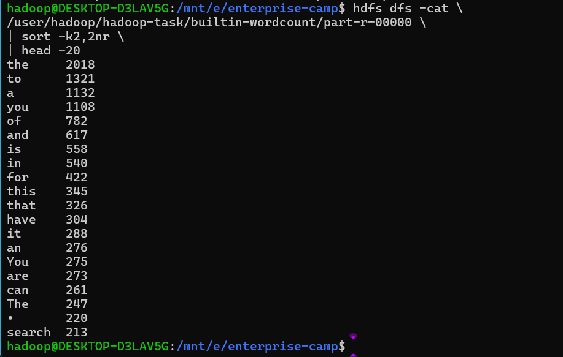
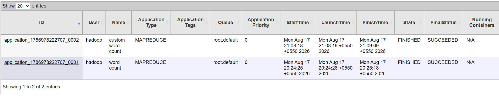
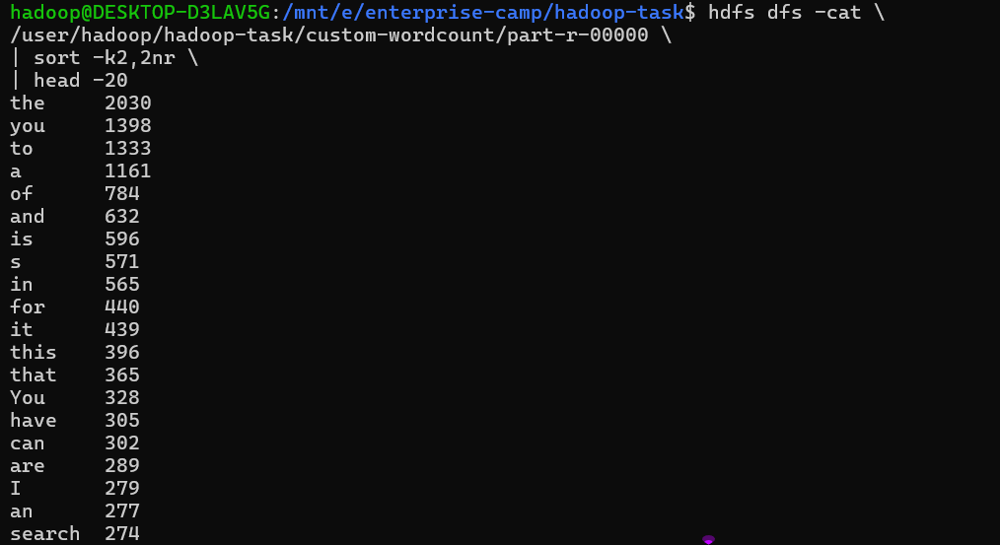
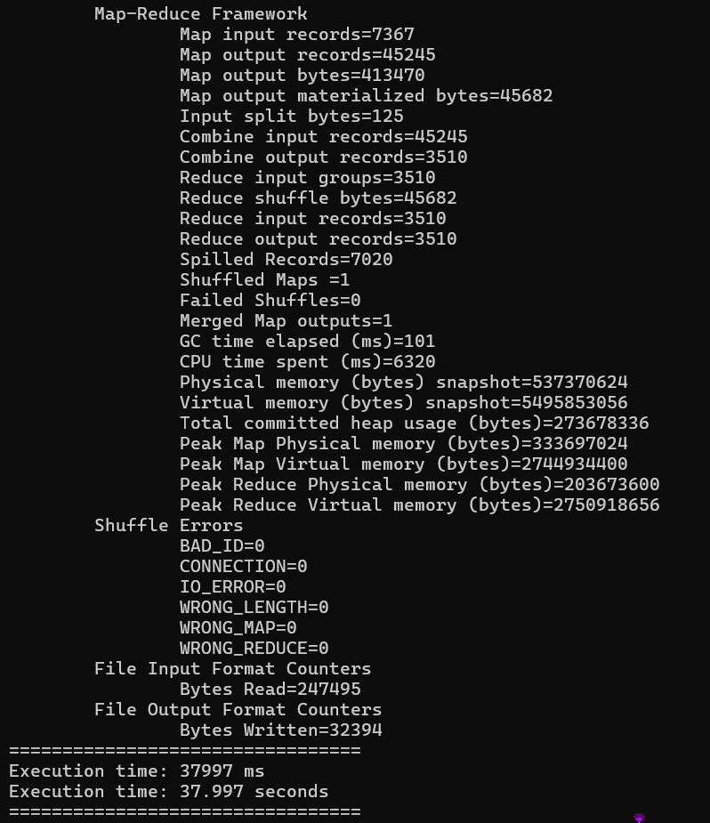
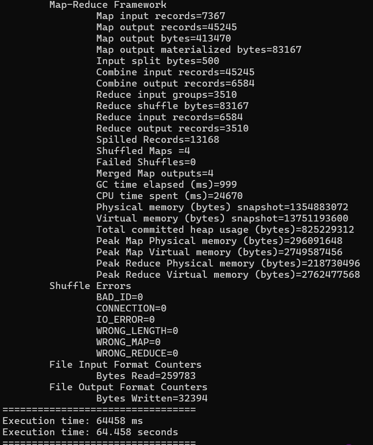
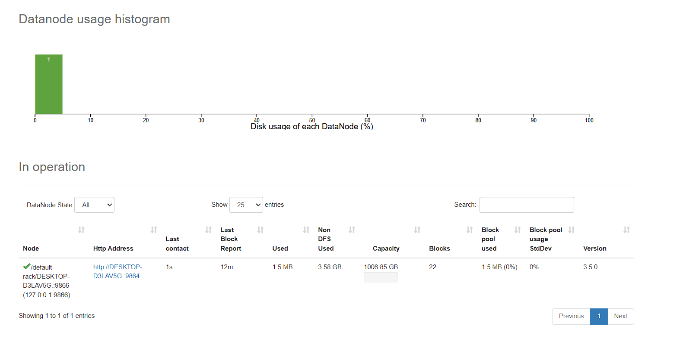

# Hadoop MapReduce Practice — Book WordCount on Ubuntu WSL

This project documents a Hadoop MapReduce workflow completed on Ubuntu running under WSL on Windows. A PDF book was converted to plain text, uploaded to HDFS, processed first with Hadoop's built-in WordCount example, and then processed with a custom Java MapReduce implementation that removes punctuation. Execution time and input split size were also tested.

## Environment

- Ubuntu on WSL
- Dedicated Hadoop user: `hadoop`
- Hadoop `3.5.0`
- OpenJDK `17.0.19`
- `javac 17.0.19`
- Passwordless SSH to `localhost`
- Windows project path: `E:\enterprise-camp`
- WSL project path: `/mnt/e/enterprise-camp`

## Project structure

```text
E:\enterprise-camp
├── data
│   ├── grokking-algorithms-illustrated-programmers-curious.pdf
│   └── book.txt
├── doc
│   └── screenshots
└── hadoop-task
    ├── src
    │   └── WordCount.java
    ├── build
    └── results
        ├── builtin-wordcount.txt
        └── custom-wordcount.txt
```

---

## 1. Start Ubuntu, SSH, and Hadoop

Switch to the Hadoop user if needed:

```bash
su - hadoop
```

Verify SSH:

```bash
ssh localhost

sudo service ssh start 
# run this if ssh is not running
```

If Hadoop is not already running:

```bash
start-dfs.sh
start-yarn.sh
```

Check Hadoop processes:

```bash
jps
```

Expected processes include:

```text
NameNode
DataNode
SecondaryNameNode
ResourceManager
NodeManager
Jps
```

### Screenshot 




---

## 2. Convert the PDF to text

The source PDF is:

```text
data/grokking-algorithms-illustrated-programmers-curious.pdf
```

Install `pdftotext` if required:

```bash
sudo apt update
sudo apt install poppler-utils
```

Convert the PDF:

```bash
cd /mnt/e/enterprise-camp

pdftotext \
  data/grokking-algorithms-illustrated-programmers-curious.pdf \
  data/book.txt
```

Inspect the text:

```bash
ls -lh data/
head -20 data/book.txt
wc -l data/book.txtl
wc -w data/book.txt
```

Observed:

```text
book.txt: approximately 242 KB
wc -l: 7366 lines
wc -w: 43251 words
```




---

## 3. Create HDFS input directory and upload the book

Create the HDFS directory:

```bash
hdfs dfs -mkdir -p /user/hadoop/hadoop-task/input
```

Upload the text file:

```bash
hdfs dfs -put \
  /mnt/e/enterprise-camp/data/book.txt \
  /user/hadoop/hadoop-task/input/
```

Verify:

```bash
hdfs dfs -ls /user/hadoop/hadoop-task/input
hdfs dfs -du -h /user/hadoop/hadoop-task/input/book.txt
```

Observed file:

```text
-rw-r--r--   1 hadoop supergroup 247495 ... /user/hadoop/hadoop-task/input/book.txt
```

### Screenshot



---

## 4. Run Hadoop's built-in WordCount

Run:

```bash
hadoop jar \
  $HADOOP_HOME/share/hadoop/mapreduce/hadoop-mapreduce-examples-3.5.0.jar \
  wordcount \
  /user/hadoop/hadoop-task/input \
  /user/hadoop/hadoop-task/builtin-wordcount
```

Check the output directory:

```bash
hdfs dfs -ls /user/hadoop/hadoop-task/builtin-wordcount
```

Expected:

```text
_SUCCESS
part-r-00000
```

Inspect the beginning of the reducer output:

```bash
hdfs dfs -cat \
  /user/hadoop/hadoop-task/builtin-wordcount/part-r-00000 \
  | head -50
```

Example output included punctuation as part of tokens:

```text
#       3
#0,     1
$1,500. 7
(BFS).  1
```

Find the 20 most frequent tokens:

```bash
hdfs dfs -cat \
  /user/hadoop/hadoop-task/builtin-wordcount/part-r-00000 \
  | sort -k2,2nr \
  | head -20
```

Save the complete reducer result locally:

```bash
hdfs dfs -cat \
  /user/hadoop/hadoop-task/builtin-wordcount/part-r-00000 \
  > /mnt/e/enterprise-camp/hadoop-task/results/builtin-wordcount.txt
```

The built-in result contained:

```text
6122 distinct token forms
```

### Screenshot






---

## 5. Hadoop Mapper and Reducer types

For WordCount, the Mapper receives:

```text
(LongWritable, Text)
```

- `LongWritable` = byte offset of the input record.
- `Text` = one line of input text.

The Mapper emits:

```text
(Text, IntWritable)
```

Example:

```text
("algorithm", 1)
```

After shuffle and sort, the Reducer receives:

```text
(Text, Iterable<IntWritable>)
```

Example:

```text
("algorithm", [1, 1, 1, 1, ...])
```

The Reducer emits:

```text
(Text, IntWritable)
```

Example:

```text
("algorithm", 84)
```

---

## 6. Custom Java WordCount

Source file:

```text
hadoop-task/src/WordCount.java
```

The custom Mapper removes punctuation before tokenization:

```java
String cleanLine = value.toString()
        .replaceAll("[^A-Za-z0-9\\s]", "");

StringTokenizer tokenizer = new StringTokenizer(cleanLine);
```

The Mapper declaration is:

```java
extends Mapper<LongWritable, Text, Text, IntWritable>
```

The Reducer declaration is:

```java
extends Reducer<Text, IntWritable, Text, IntWritable>
```

Compile:

```bash
cd /mnt/e/enterprise-camp/hadoop-task
rm -rf build/*

javac \
  -classpath "$(hadoop classpath --glob)" \
  -d build \
  src/WordCount.java
```

Check compiled classes:

```bash
find build -type f
```

Create the JAR in the Linux filesystem:

```bash
jar -cvf /home/hadoop/WordCount.jar -C build .
```

> Note: Creating `WordCount.jar` directly under `/mnt/e/...` produced `java.nio.file.FileSystemException: Operation not permitted`, so the JAR was created under `/home/hadoop/` instead.

Run the custom job:

```bash
hadoop jar /home/hadoop/WordCount.jar WordCount \
  /user/hadoop/hadoop-task/input \
  /user/hadoop/hadoop-task/custom-wordcount
```

Verify:

```bash
hdfs dfs -ls /user/hadoop/hadoop-task/custom-wordcount
```

Expected:

```text
_SUCCESS
part-r-00000
```

Save the result locally:

```bash
hdfs dfs -cat \
  /user/hadoop/hadoop-task/custom-wordcount/part-r-00000 \
  > /mnt/e/enterprise-camp/hadoop-task/results/custom-wordcount.txt
```

Count distinct output keys:

```bash
wc -l /mnt/e/enterprise-camp/hadoop-task/results/custom-wordcount.txt
```

Observed:

```text
3510 distinct cleaned tokens
```

Comparison:

| Version                              | Distinct output keys |
| ------------------------------------ | -------------------: |
| Built-in WordCount                   |                 6122 |
| Custom punctuation-cleaned WordCount |                 3510 |

The custom output contains fewer distinct keys because punctuation variants are normalized before counting.

### Screenshot 






---

## 7. Measure MapReduce execution time

Timing was added around `job.waitForCompletion(true)`:

```java
long startTime = System.currentTimeMillis();
boolean success = job.waitForCompletion(true);
long endTime = System.currentTimeMillis();

System.out.println("=================================");
System.out.println("Execution time: " + (endTime - startTime) + " ms");
System.out.println("Execution time: " + ((endTime - startTime) / 1000.0) + " seconds");
System.out.println("=================================");

System.exit(success ? 0 : 1);
```

### Default run

```bash
hadoop jar /home/hadoop/WordCount.jar WordCount \
  /user/hadoop/hadoop-task/input \
  /user/hadoop/hadoop-task/timing-default
```

Important counters:

```text
Map input records=7367
Map output records=45245
Combine output records=3510
Reduce input groups=3510
Reduce output records=3510
Shuffled Maps=1
CPU time spent=6320 ms
Execution time=37.997 seconds
```

### Screenshot 




---

## 8. Experiment with `split.maxsize`

The configuration used was:

```java
job.getConfiguration().setLong(
    "mapreduce.input.fileinputformat.split.maxsize",
    VALUE
);
```

### 128 KiB split

```java
131072
```

Run output directory:

```text
/user/hadoop/hadoop-task/timing-128kb
```

Observed:

```text
Shuffled Maps=2
Combine output records=4927
CPU time spent=17690 ms
Execution time=60.648 seconds
```

### 64 KiB split

```java
65536
```

Run output directory:

```text
/user/hadoop/hadoop-task/timing-64kb
```

Observed:

```text
Shuffled Maps=4
Combine output records=6584
CPU time spent=24670 ms
Execution time=64.458 seconds
```

### Results

| Split setting | Mapper tasks | Combine output records | CPU time |     Execution time |
| ------------- | -----------: | ---------------------: | -------: | -----------------: |
| Default       |            1 |                   3510 |   6.32 s | **37.997 s** |
| 128 KiB       |            2 |                   4927 |  17.69 s | **60.648 s** |
| 64 KiB        |            4 |                   6584 |  24.67 s | **64.458 s** |

### Observation

Reducing the maximum split size increased the number of Mapper tasks, but it did not change the final result: every run still produced `3510` reducer output records.

For this small ~242 KB input file, smaller splits made the job slower. The reason is that Hadoop had to schedule and execute more Mapper tasks, run more Combiner instances, shuffle more intermediate records, merge more map outputs, and spend more CPU/runtime overhead. The dataset was too small for the additional parallelism to provide a benefit.

### Screenshot



---

## 9. HDFS replication factor

Check the input file:

```bash
hdfs dfs -ls /user/hadoop/hadoop-task/input
```

Observed:

```text
-rw-r--r--   1 hadoop supergroup 247495 ... /user/hadoop/hadoop-task/input/book.txt
```

The value `1` is the replication factor for the file in this single-node setup.

Check directories:

```bash
hdfs dfs -ls /user/hadoop/hadoop-task
```

Observed:

```text
drwxr-xr-x   - hadoop supergroup ... builtin-wordcount
drwxr-xr-x   - hadoop supergroup ... custom-wordcount
drwxr-xr-x   - hadoop supergroup ... input
drwxr-xr-x   - hadoop supergroup ... timing-128kb
drwxr-xr-x   - hadoop supergroup ... timing-64kb
drwxr-xr-x   - hadoop supergroup ... timing-default
```

Directories show `-` because HDFS replication applies to **file data blocks**, not to directories. Directories are metadata maintained by the NameNode and do not contain their own replicated data blocks.

### Screenshot 


---

## 10. Hadoop web interfaces

### YARN ResourceManager

```text
http://localhost:8088
```

Use this UI to inspect MapReduce applications, progress, state, and final status.

### HDFS NameNode

```text
http://localhost:9870
```

Use this UI to inspect HDFS health, NameNode status, and live DataNodes.

### Screenshot 



---

## 11. Useful commands

List HDFS project contents:

```bash
hdfs dfs -ls /user/hadoop/hadoop-task
```

Read a reducer result:

```bash
hdfs dfs -cat /user/hadoop/hadoop-task/custom-wordcount/part-r-00000
```

Remove an old output directory before rerunning a job:

```bash
hdfs dfs -rm -r /user/hadoop/hadoop-task/custom-wordcount
```

Check HDFS disk usage:

```bash
hdfs dfs -du -h /user/hadoop/hadoop-task
```

Stop Hadoop when finished:

```bash
stop-yarn.sh
stop-dfs.sh
```

---

## Main observations

1. Hadoop's built-in WordCount successfully processed the text input stored in HDFS.
2. The built-in example retained punctuation, which produced many token variants.
3. A custom Java Mapper using `replaceAll()` reduced the number of distinct output keys from `6122` to `3510`.
4. The custom Java Mapper used `LongWritable, Text` as input and emitted `Text, IntWritable`.
5. The Reducer accepted `Text, Iterable<IntWritable>` and emitted `Text, IntWritable`.
6. On this small dataset, decreasing `split.maxsize` increased the number of Mapper tasks but made execution slower.
7. The output stayed logically identical across split-size experiments: `3510` final reducer records.
8. HDFS files have a replication factor, while directories do not because replication applies to file blocks.
