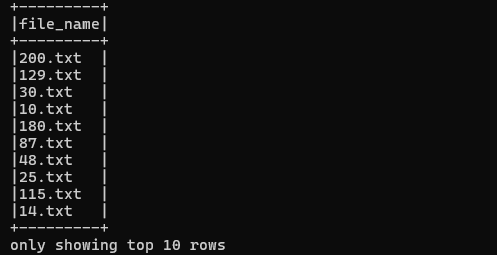
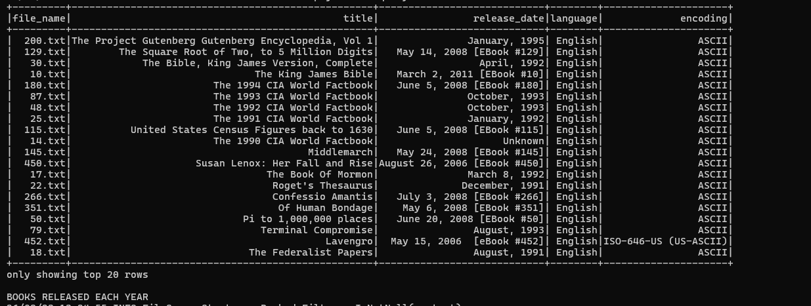
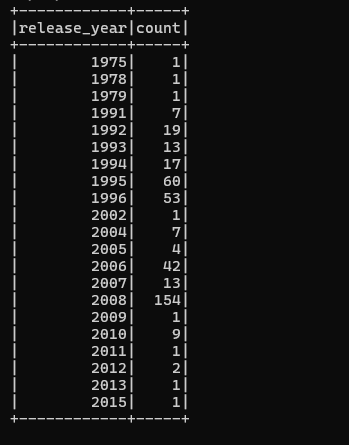
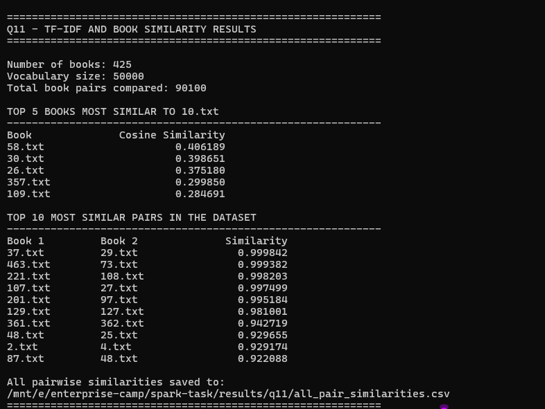
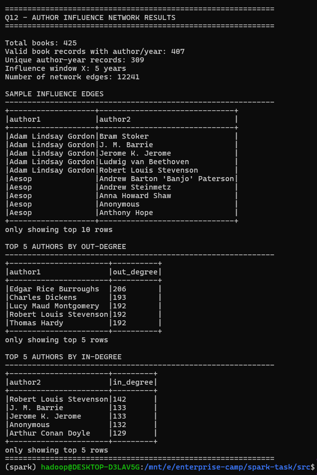

# Apache Spark / PySpark — Gutenberg Analysis

This project contains the PySpark implementation for the Spark section of the assignment, using the Project Gutenberg D184MB text collection.

The analysis covers:

- metadata extraction and aggregation
- TF-IDF document representation
- cosine-similarity analysis across books
- author influence-network construction using publication years

---

## Environment

```text
Ubuntu on WSL
Python 3.12
PySpark 4.2.0
Java 17
Spark local mode
```

Activate the virtual environment:

```bash
source /home/hadoop/.venvs/spark/bin/activate
```

---

## Repository Layout

```text
enterprise-camp/
├── data/
│   └── D184MB/
│       └── D184MB/
│           ├── 10.txt
│           ├── 11.txt
│           └── ...
│
├── doc/
│   └── screenshots/
│       └── spark/
│           ├── 01-books-df-loaded.png
│           ├── 02-q10-extracted-metadata.png
│           ├── 03-q10-analysis-results.png
│           ├── 04-q11-tfidf-cosine-results.png
│           └── 05-q12-author-network-results.png
│
└── spark-task/
    ├── src/
    │   ├── common.py
    │   ├── test_load_books.py
    │   ├── q10_metadata.py
    │   ├── q11_tfidf.py
    │   └── q12_author_network.py
    │
    ├── results/
    │   └── q11/
    │       └── all_pair_similarities.csv
    │
    ├── README.md
    └── notes.md
```

---

# Dataset

The Project Gutenberg dataset is stored under:

```text
E:\enterprise-camp\data\D184MB\D184MB
```

The number of text files was verified with:

```bash
find /mnt/e/enterprise-camp/data/D184MB/D184MB -type f -name "*.txt" | wc -l
```

Result:

```text
425
```

The Spark loader reads the dataset recursively from:

```text
file:///mnt/e/enterprise-camp/data/D184MB
```

The resulting DataFrame has the schema:

```text
file_name : string
text      : string
```

Run the loader check with:

```bash
cd /mnt/e/enterprise-camp/spark-task/src
spark-submit test_load_books.py
```

### Dataset Load Output



---

# Q10 — Metadata Extraction and Analysis

Source:

[View `q10_metadata.py`](src/q10_metadata.py)

Run:

```bash
spark-submit q10_metadata.py
```

The script extracts the following Gutenberg metadata fields:

```text
title
release_date
language
encoding
release_year
```

Regular expressions are used to identify labelled metadata lines inside each text file. The release year is extracted from the release-date field and converted safely so malformed or missing years do not terminate the Spark job.

## Extracted Metadata



## Books Released per Year



Observed counts:

| Release year | Books |
| -----------: | ----: |
|         1975 |     1 |
|         1978 |     1 |
|         1979 |     1 |
|         1991 |     7 |
|         1992 |    19 |
|         1993 |    13 |
|         1994 |    17 |
|         1995 |    60 |
|         1996 |    53 |
|         2002 |     1 |
|         2004 |     7 |
|         2005 |     4 |
|         2006 |    42 |
|         2007 |    13 |
|         2008 |   154 |
|         2009 |     1 |
|         2010 |     9 |
|         2011 |     1 |
|         2012 |     2 |
|         2013 |     1 |
|         2015 |     1 |

## Language Distribution

The most common extracted language was:

```text
English → 404
```

Other extracted values included:

```text
Latin → 6
```

One malformed extracted value also appeared:

```text
and thus we see how, little by little, the study of man → 1
```

This is an example of noisy or inconsistent source metadata and illustrates a limitation of regex-based extraction.

## Average Title Length

```text
22.023529411764706 characters
```

Rounded:

```text
22.02 characters
```

## Notes on Metadata Quality

The extraction depends on consistent Gutenberg header formatting. Real-world issues include:

- missing metadata fields
- unexpected spacing
- inconsistent capitalization
- malformed field values
- inconsistent release-date formats
- text lines that accidentally match a metadata pattern

For production-grade processing, extracted metadata should be normalized and validated before downstream analysis.

---

# Q11 — TF-IDF and Cosine Similarity

Source:

[View `q11_tfidf.py`](src/q11_tfidf.py)

Run:

```bash
spark-submit --driver-memory 2g q11_tfidf.py
```

The processing pipeline is:

```text
Raw book text
→ remove Gutenberg header/footer
→ lowercase
→ remove punctuation
→ tokenize
→ remove stop words
→ term frequency
→ inverse document frequency
→ TF-IDF vectors
→ L2 normalization
→ cosine similarity
```

## TF-IDF

Term Frequency measures how often a term occurs within a document.

Inverse Document Frequency reduces the weight of terms that appear across many documents.

TF-IDF combines both so that terms important to a particular book receive higher weights than globally common terms.

## Cosine Similarity

Each book is represented as a TF-IDF vector.

Cosine similarity measures how closely two vector directions align:

```text
closer to 1 → more similar
closer to 0 → less similar
```

Because the TF-IDF vectors are L2-normalized before comparison, cosine similarity can be obtained from their dot product.

## Results

```text
Number of books: 425
Vocabulary size: 50000
Total unique book pairs compared: 90100
```

The pair count is:

```text
425 × 424 / 2 = 90,100
```

### Top 5 Books Most Similar to `10.txt`

| Book    | Cosine similarity |
| ------- | ----------------: |
| 58.txt  |          0.406189 |
| 30.txt  |          0.398651 |
| 26.txt  |          0.375180 |
| 357.txt |          0.299850 |
| 109.txt |          0.284691 |

### Highest-Similarity Pairs Observed

| Book 1  | Book 2  | Similarity |
| ------- | ------- | ---------: |
| 37.txt  | 29.txt  |   0.999842 |
| 463.txt | 73.txt  |   0.999382 |
| 221.txt | 108.txt |   0.998203 |
| 107.txt | 27.txt  |   0.997499 |
| 201.txt | 97.txt  |   0.995184 |
| 129.txt | 127.txt |   0.981001 |
| 361.txt | 362.txt |   0.942719 |
| 48.txt  | 25.txt  |   0.929655 |
| 2.txt   | 4.txt   |   0.929174 |
| 87.txt  | 48.txt  |   0.922088 |

All pairwise similarities are stored in:

[View `all_pair_similarities.csv`](results/q11/all_pair_similarities.csv)

### Q11 Output



## Scalability

All-pairs similarity requires approximately:

```text
n(n - 1) / 2
```

comparisons, which grows quadratically with the number of books.

Spark helps distribute preprocessing and vector construction, but a full pairwise comparison still becomes expensive at large scale. For much larger collections, approximate nearest-neighbour methods, locality-sensitive hashing, or other similarity-search techniques would be preferable.

---

# Q12 — Author Influence Network

Source:

[View `q12_author_network.py`](src/q12_author_network.py)

Run:

```bash
spark-submit --driver-memory 2g q12_author_network.py
```

The script extracts:

```text
author
release_date
release_year
```

Duplicate `(author, release_year)` records are removed before the network is built.

A directed edge:

```text
author1 → author2
```

is created when:

```text
year2 > year1
```

and:

```text
year2 - year1 <= 5
```

The influence window is therefore:

```text
X = 5 years
```

## Network Results

```text
Total books: 425
Valid book records with author/year: 407
Unique author-year records: 309
Influence window: 5 years
Number of network edges: 12241
```

### Top 5 Authors by Out-Degree

| Author                 | Out-degree |
| ---------------------- | ---------: |
| Edgar Rice Burroughs   |        206 |
| Charles Dickens        |        193 |
| Lucy Maud Montgomery   |        192 |
| Robert Louis Stevenson |        192 |
| Thomas Hardy           |        192 |

Out-degree represents the number of outgoing possible influence relationships under the five-year publication rule.

### Top 5 Authors by In-Degree

| Author                 | In-degree |
| ---------------------- | --------: |
| Robert Louis Stevenson |       142 |
| J. M. Barrie           |       133 |
| Jerome K. Jerome       |       133 |
| Anonymous              |       132 |
| Arthur Conan Doyle     |       129 |

In-degree represents the number of incoming possible influence relationships under the same temporal rule.

### Q12 Output



## Representation

The network is represented as a Spark DataFrame containing directed author pairs:

```text
(author1, author2)
```

A DataFrame is suitable because it provides:

- structured schemas
- filtering and aggregation
- joins and grouping
- Spark SQL compatibility
- query optimization through Spark's execution engine

An RDD could also represent the graph, but DataFrames are more convenient for this structured workflow.

## Effect of the Time Window

A smaller value of `X` produces fewer edges and a sparser network.

A larger value of `X` produces more edges and a denser network.

As the time window increases, in-degree and out-degree values generally increase because more author pairs satisfy the temporal condition.

## Limitations

The network models possible temporal influence only.

Publication dates being close together do not prove that one author influenced another. The method does not consider:

- genre
- language
- geography
- historical context
- citations
- correspondence
- whether one author actually read another author's work

Values such as `Anonymous` also show that author metadata may require normalization before more serious graph analysis.

## Scaling

The current implementation uses a cross join to generate candidate author pairs.

For millions of records, unrestricted all-to-all comparison would be expensive. More scalable approaches include:

- filtering invalid records early
- deduplicating author-year records before joins
- partitioning by release year
- joining only nearby year ranges
- caching reused DataFrames
- using graph-processing or distributed similarity techniques where appropriate

---

# Results Summary

| Analysis                           |           Result |
| ---------------------------------- | ---------------: |
| Books loaded                       |              425 |
| Most common language               |          English |
| English-language records           |              404 |
| Average title length               | 22.02 characters |
| Q11 vocabulary size                |           50,000 |
| Q11 unique book pairs              |           90,100 |
| Q12 valid author/year book records |              407 |
| Q12 unique author-year records     |              309 |
| Q12 influence edges                |           12,241 |
